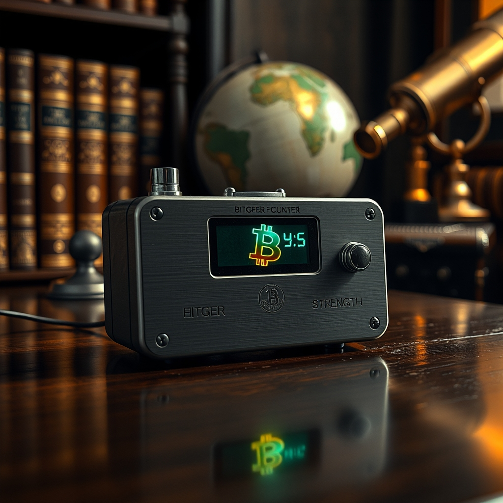

BTCBeeper_SRS.md
81 lines

md

coinbase-websocket.txt
1 line

txt

review the attached files and build out the project described ,  i have an api key and will store it in .env insidethe root directory, i

I'll help you build the BTC Live Tape Audio Visualizer project based on your SRS document. Let me create a complete implementation with the FastAPI backend and Svelte frontend.

Backend - main.py (FastAPI)
Code 

Frontend - App.svelte
Code 
Now let me create the configuration files and setup instructions:

requirements.txt
Code 

package.json
Code 

rollup.config.js
Code 

src/main.js
Code 

public/index.html
Interactive artifact 

public/global.css
Code 

Continue

public/global.css
Code 

.env.example
Code 

src/App.svelte
Code 

README.md - Setup Instructions
Document 

Dockerfile
Code 

docker-compose.yml
Code 
Perfect! I've created a complete BTC Live Tape Audio Visualizer project based on your SRS document. Here's what I've built:

Project Structure
Backend (FastAPI)
main.py: FastAPI server with WebSocket support that connects to Coinbase Advanced Trade API
Streams real-time BTC/USD trades to connected clients
Handles connection management and error recovery
Health check endpoint
Frontend (Svelte)
App.svelte: Main component with real-time price display and audio visualization
Web Audio API integration for dynamic sound generation
Responsive design with

🎵 BTC Live Tape Audio Visualizer
A real-time web application that streams live BTC/USD trades from Coinbase, displays price and trade statistics, and generates dynamic audio based on trading activity.

Features
Real-time BTC/USD trade streaming from Coinbase Advanced Trade API
Dynamic audio generation using Web Audio API
Live price tracking with visual indicators
Trade statistics including TPS, volume, and average trade size
Responsive design with modern UI
Audio visualization with volume bars and pulse indicators
Architecture
Backend: FastAPI (Python) with WebSocket support
Frontend: Svelte with Web Audio API
Data Source: Coinbase Advanced Trade WebSocket API
Audio: Browser-generated tones based on trade activity
Prerequisites
Python 3.8+
Node.js 14+
Modern web browser with Web Audio API support
Coinbase API credentials (optional for public data)
Installation
1. Clone the Repository
bash
git clone <repository-url>
cd btc-live-tape-visualizer
2. Backend Setup
Create a virtual environment and install dependencies:

bash
python -m venv venv
source venv/bin/activate  # On Windows: venv\Scripts\activate
pip install -r requirements.txt
3. Environment Configuration
Create a .env file in the root directory:

bash
cp .env.example .env
Edit .env with your Coinbase API credentials (optional for public feed):

COINBASE_API_KEY=your_api_key_here
COINBASE_API_SECRET=your_api_secret_here
4. Frontend Setup
Install Node.js dependencies:

bash
npm install
Running the Application
1. Start the Backend Server
bash
python main.py
The FastAPI server will start on http://localhost:8000

2. Start the Frontend Development Server
In a new terminal:

bash
npm run dev
The Svelte app will start on http://localhost:8080

3. Access the Application
Open your browser and navigate to http://localhost:8080

Usage
Enable Audio: Click the "🔇 Audio Off" button to enable audio visualization
View Live Data: Watch real-time BTC price updates and trade statistics
Listen to Trades: Each trade generates a unique tone based on:
Trade size (larger trades = lower frequency)
Buy/sell side (different tonal characteristics)
Volume intensity (affects gain/volume)
Audio Features
Dynamic Frequency: Trade size affects tone frequency
Buy/Sell Differentiation: Different tones for buy vs sell orders
Volume Mapping: Trade volume affects audio intensity
Real-time Generation: Audio generated in real-time using Web Audio API
Project Structure
btc-live-tape-visualizer/
├── main.py                 # FastAPI backend server
├── requirements.txt        # Python dependencies
├── .env.example           # Environment variables template
├── package.json           # Node.js dependencies
├── rollup.config.js       # Rollup build configuration
├── public/
│   ├── index.html         # HTML template
│   └── global.css         # Global styles
└── src/
    ├── main.js            # Svelte app entry point
    └── App.svelte         # Main Svelte component
API Endpoints
Backend Endpoints
GET / - API status
GET /health - Health check with connection status
WS /ws - WebSocket endpoint for real-time trade data
WebSocket Messages
The backend sends JSON messages with the following structure:

json
{
  "type": "trade",
  "data": {
    "price": 45000.50,
    "size": 0.123456,
    "side": "buy",
    "timestamp": "2023-01-01T12:00:00Z",
    "trade_id": "12345"
  }
}
Development
Backend Development
The FastAPI backend automatically connects to Coinbase's WebSocket API and broadcasts trade data to connected clients.

Frontend Development
The Svelte frontend connects to the backend WebSocket and provides:

Real-time price display
Trade statistics calculation
Audio generation and visualization
Responsive UI components
Audio Implementation
The Web Audio API implementation includes:

Oscillator for tone generation
Gain nodes for volume control
Frequency mapping based on trade characteristics
Real-time audio parameter updates
Production Deployment
Backend Deployment
Install dependencies on your VPS
Configure environment variables
Run with a production ASGI server:
bash
uvicorn main:app --host 0.0.0.0 --port 8000
Frontend Deployment
Build the production bundle:
bash
npm run build
Serve the public directory with a web server (nginx, Apache, etc.)
Docker Deployment (Optional)
You can containerize the application using Docker for easier deployment.

Troubleshooting
Common Issues
WebSocket Connection Failed: Ensure the backend is running on port 8000
Audio Not Working: Check browser permissions and Web Audio API support
No Trade Data: Verify Coinbase API connectivity and credentials
Browser Compatibility
Chrome 66+
Firefox 60+
Safari 11.1+
Edge 79+
Contributing
Fork the repository
Create a feature branch
Make your changes
Submit a pull request
License
This project is licensed under the MIT License.

Disclaimer
This application is for educational and entertainment purposes only. It is not intended for trading or financial advice. Use at your own risk.

