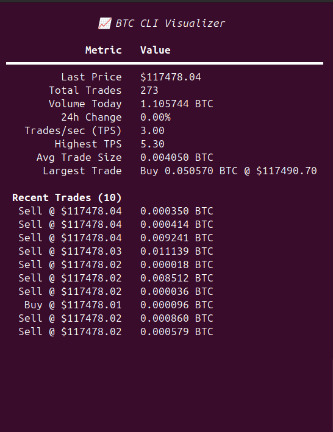
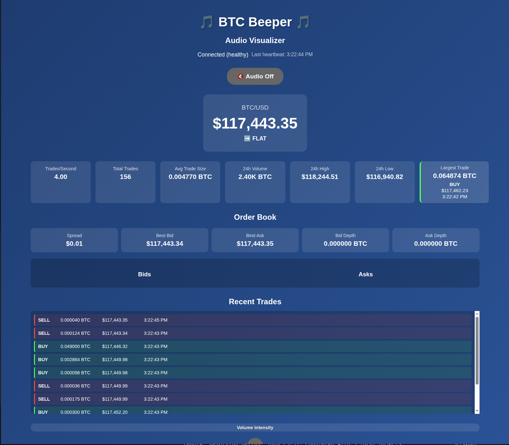

# 🎵 BTCBeeper: Live BTC Audio & Visual Tape

BTCBeeper is a real-time Bitcoin (BTC/USD) trade visualizer and audio generator. It streams live trades from Coinbase, displays rich statistics, and generates Geiger-counter-style audio feedback based on trading activity. Choose from a modern web UI, a terminal-based CLI, or imagine a physical device for the ultimate retro experience.

---

## Table of Contents
- [Overview](#overview)
- [Features](#features)
- [UI Options & Examples](#ui-options--examples)
- [Architecture](#architecture)
- [Installation](#installation)
- [Usage](#usage)
- [Audio Features](#audio-features)
- [API & Data Flow](#api--data-flow)
- [Troubleshooting](#troubleshooting)
- [Contributing](#contributing)
- [License & Disclaimer](#license--disclaimer)

---

## Overview
BTCBeeper brings the excitement of the trading floor to your screen and speakers. It visualizes live BTC/USD trades and statistics, and turns every trade into a satisfying click or tone, just like a Geiger counter for Bitcoin volume.

---

## Features
- **Real-time BTC/USD trade streaming** from Coinbase Advanced Trade API
- **Multiple UI options:**
  - Modern web dashboard (Svelte, Web Audio API)
  - Terminal-based CLI (Rich, Pygame)
  - (Concept) Physical hardware display
- **Dynamic audio feedback** (Geiger counter clicks, mapped to trade size/type)
- **Live price, trade stats, and order book**
- **Customizable audio** (multiple click sounds)
- **Responsive, modern design**
- **Docker & cross-platform support**

---

## UI Options & Examples

### 1. Terminal CLI Visualizer
A retro, text-based interface for your terminal. See live stats and hear clicks for every trade.



- Live price, trades, TPS, volume, and more
- Recent trades list
- Toggle audio with 'a' key

### 2. Web Audio Visualizer
A modern, interactive dashboard in your browser. Visualize trades, stats, and order book, with real-time audio.



- Live price, 24h stats, order book, and recent trades
- Audio on/off toggle
- Volume intensity and trade direction visualization

### 3. Hardware Device (Concept)
Imagine BTCBeeper as a physical Geiger counter for Bitcoin! (Concept art below)


---

## Architecture
- **Backend:** Python FastAPI, WebSocket, connects to Coinbase, streams BTC trades
- **Frontend:** Svelte, Web Audio API, modern UI
- **CLI:** Python, Rich (for TUI), Pygame (for audio)
- **Audio:** Geiger counter click generator (custom WAVs)

---

## Installation
### Prerequisites
- Python 3.8+
- Node.js 14+
- Modern browser (Web Audio API support)
- (Optional) Coinbase API credentials

### 1. Clone the Repository
```bash
git clone <repository-url>
cd BTCBeeper
```

### 2. Backend Setup
```bash
python -m venv venv
source venv/bin/activate  # On Windows: venv\Scripts\activate
pip install -r src/requirements.txt
```

### 3. Environment Configuration
```bash
cp .env.example .env
# Edit .env for API keys (optional)
```

### 4. Frontend Setup
```bash
cd src
npm install
```

### 5. (Optional) Docker
```bash
docker-compose up --build
```

---

## Usage
### Web UI
1. Start backend:
   ```bash
   python src/main.py
   # or with Docker: docker-compose up
   ```
2. Start frontend:
   ```bash
   cd src
   npm run dev
   ```
3. Open [http://localhost:8080](http://localhost:8080)

### CLI Visualizer
1. Start backend (as above)
2. In a new terminal:
   ```bash
   python src/cli.py
   ```
3. Press 'a' to toggle audio on/off

---

## Audio Features
- **Trade size → click frequency** (larger trades = lower pitch)
- **Buy/Sell → different click tones**
- **Volume intensity → click volume**
- **Multiple click sound variations** (see `data/sounds/`)
- **Web:** Uses browser Web Audio API
- **CLI:** Uses Pygame for WAV playback

---

## API & Data Flow
- **WebSocket endpoint:** `/ws` (real-time BTC data)
- **Sample message:**
  ```json
  {
    "type": "btc_trade",
    "data": {
      "price": 45000.50,
      "size": 0.123456,
      "side": "buy",
      "timestamp": "2023-01-01T12:00:00Z",
      "trade_id": "12345"
    }
  }
  ```
- **Other endpoints:**
  - `/health` (status)
  - `/btc/channels` (available data channels)

---

## Troubleshooting
- **WebSocket Connection Failed:** Ensure backend is running on port 8000
- **Audio Not Working:** Check browser permissions or Pygame install
- **No Trade Data:** Verify Coinbase connectivity
- **CLI Audio:** Press 'a' to toggle, ensure sound device is available

---

## Contributing
- Fork the repo, create a feature branch, submit a PR
- Follow PEP8 and code quality guidelines
- Add docstrings and comments for financial logic

---

## License & Disclaimer
- MIT License
- For educational/entertainment use only. Not financial advice.


