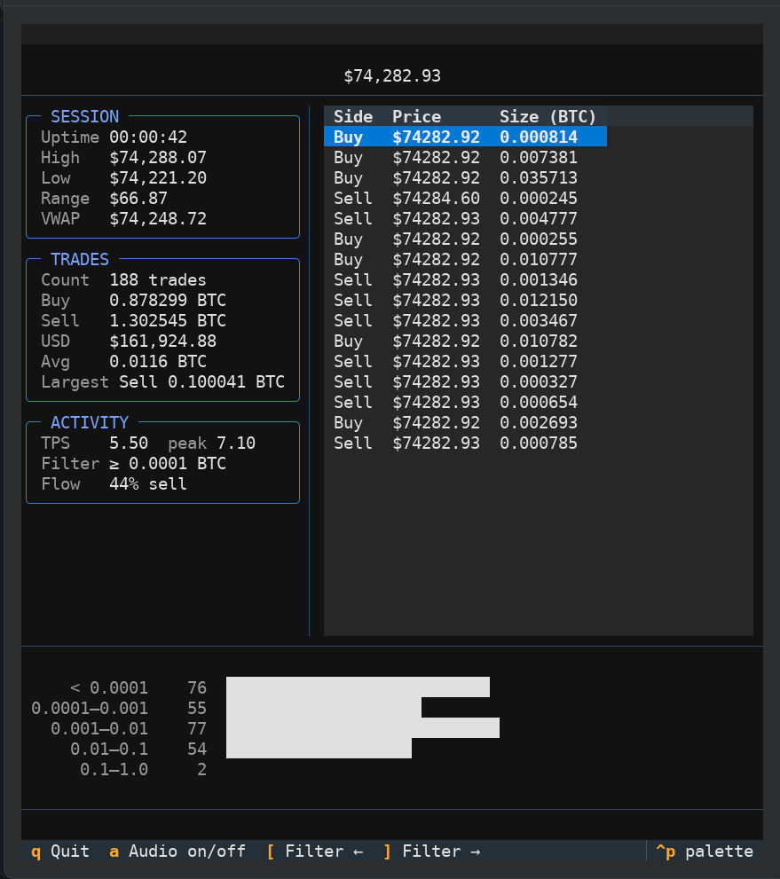
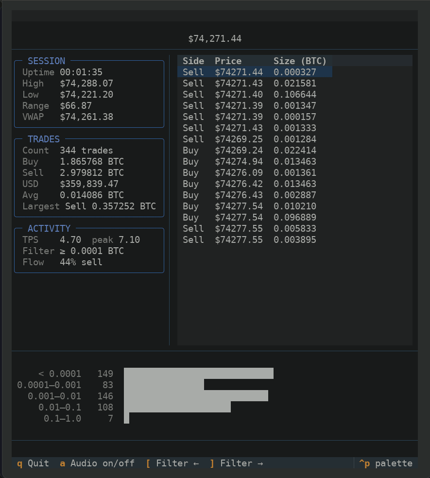

# 🎵 BTCBeeper

<div align="center">
  
</div>

Live BTC/USD trades from Coinbase, stats in the terminal, a click for every trade.





## Install

```bash
git clone <repository-url>
cd BTCBeeper
python -m venv venv
source venv/bin/activate  # Windows: venv\Scripts\activate
pip install -r requirements.txt
```

## Run

```bash
python -m src.main
```

## Controls

| Key | Action |
|-----|--------|
| `a` | Toggle audio |
| `[` / `]` | Adjust min trade size |
| `q` | Quit |

## Sounds

10 click variations in `data/sounds/`. Default is `geiger_click7.wav` — change it via the `BTCBEEPER_SOUND_PATH` env var.

To regenerate:
```bash
pip install numpy scipy
python src/click_generator.py
```

## License

MIT. Not financial advice.
