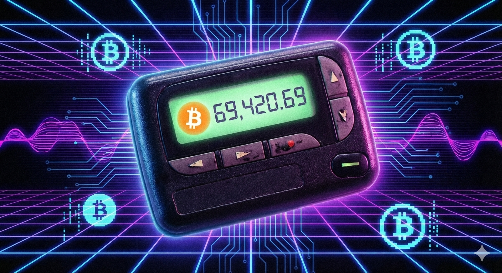
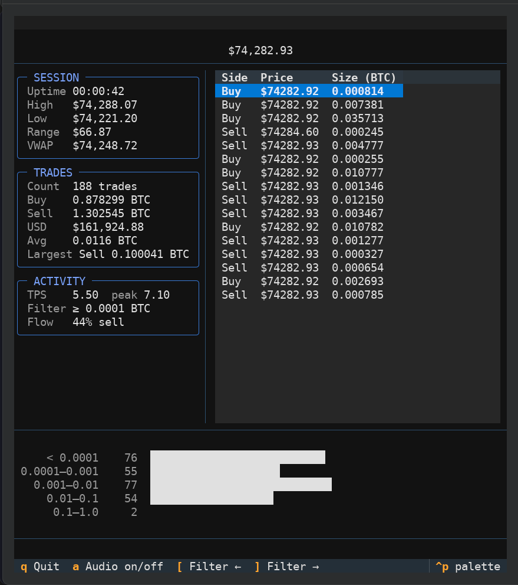
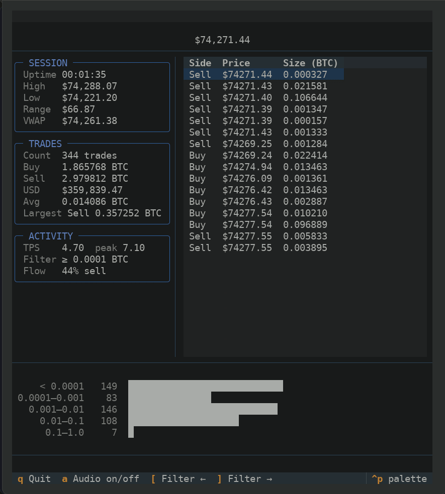

# BTCBeeper

<div align="center">
  
</div>

Live BTC/USD trades from Coinbase, stats in the terminal, a click for every trade.





## Install

```bash
git clone <repository-url>
cd BTCBeeper
python -m venv venv
source venv/bin/activate  # Windows: venv\Scripts\activate
pip install -r requirements.txt
```

## Run

```bash
python -m src.main
```

## Panels

**SESSION** — Uptime, session high/low, price range, and VWAP (colored green/red vs current price).

**TRADES** — Trade count, buy/sell volume split, total USD volume, average size, and largest trade.

**ACTIVITY** — Trades/sec, size filter, order flow imbalance (% buy vs sell), and error counts.

**Heatmap** — Trade size distribution across all incoming trades.

**Trades table** — Last 16 filtered trades. Click a row to expand order IDs and timestamp.

## Controls

| Key | Action |
|-----|--------|
| `a` | Toggle audio |
| `[` / `]` | Adjust min trade size filter |
| `q` | Quit |

## Sounds

10 click variations in `data/sounds/`. Default is `geiger_click7.wav` (buy) and `geiger_click4.wav` (sell). Override via env vars:

```bash
BTCBEEPER_SOUND_PATH=data/sounds/geiger_click1.wav python -m src.main
```

To regenerate sounds:
```bash
pip install numpy scipy
python src/click_generator.py
```

## License

MIT. Not financial advice.
