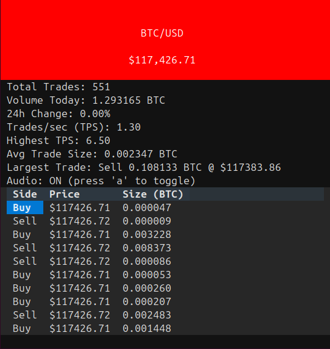

# 🎵 BTCBeeper: Live BTC Audio & Visual Tape

BTCBeeper is a real-time Bitcoin (BTC/USD) trade visualizer and audio generator. It streams live trades directly from Coinbase, displays rich statistics in a terminal-based interface, and generates Geiger-counter-style audio feedback based on trading activity.

---

## Table of Contents
- [Overview](#overview)
- [Features](#features)
- [Screenshots](#screenshots)
- [Architecture](#architecture)
- [Installation](#installation)
- [Usage](#usage)
- [Audio Features](#audio-features)
- [Troubleshooting](#troubleshooting)
- [Contributing](#contributing)
- [License & Disclaimer](#license--disclaimer)

---

## Overview
BTCBeeper brings the excitement of the trading floor to your terminal and speakers. It visualizes live BTC/USD trades and statistics in a beautiful TUI (Text User Interface), and turns every trade into a satisfying click or tone, just like a Geiger counter for Bitcoin volume.

---

## Features
- **Real-time BTC/USD trade streaming** directly from Coinbase WebSocket API
- **Terminal-based TUI** built with Textual (modern, responsive interface)
- **Audio feedback** (Geiger counter clicks via Pygame for each qualifying trade)
- **Live statistics tracking:**
  - Current BTC/USD price with color-coded animations (green up, red down)
  - Total trades count
  - Volume today (cumulative BTC)
  - Trades per second (TPS) with rolling 10-second window
  - Highest TPS recorded
  - Average trade size
  - Largest trade details
- **Trade size filtering** (5 adjustable levels: 0.0001, 0.001, 0.01, 0.1, 1.0 BTC)
- **Bot detection** (identifies patterns of 5+ trades with identical size in recent activity)
- **Recent trades table** (displays last 10 qualifying trades with side, price, and size)
- **Customizable audio** (10 pre-generated click sound variations)
- **Automatic reconnection** (handles WebSocket disconnections with retry logic)
- **Cross-platform support** (Linux, macOS, Windows)

---

## Screenshots

### Terminal CLI Visualizer
A retro, text-based interface for your terminal. See live stats and hear clicks for every trade.



- Live price with color-coded animations (green for up, red for down)
- Real-time trades table
- TPS (trades per second) tracking
- Volume and trade statistics
- Bot activity detection banner
- Toggle audio with 'a' key
- Adjustable trade size filter with `[` and `]` keys

---

## Architecture
- **Entry Point:** `main.py` - Initializes pygame mixer and launches the TUI application
- **Core Application:** `src/cli.py` - Main TUI application using Textual framework
- **WebSocket Client:** Direct connection to Coinbase WebSocket feed (`wss://ws-feed.exchange.coinbase.com`)
- **Audio System:** Pygame mixer for WAV file playback
- **Sound Generator:** `src/click_generator.py` - Optional script to generate custom click sounds (requires numpy/scipy)
- **Data Source:** Coinbase WebSocket API - Subscribes to `matches`, `ticker`, and `heartbeat` channels for BTC-USD
- **Dependencies:** 
  - `websockets` - WebSocket client library
  - `textual` - Terminal UI framework
  - `pygame` - Audio playback
  - `numpy`, `scipy` - Optional, only needed for generating click sounds

---

## Installation
### Prerequisites
- Python 3.8+
- Sound device (for audio feedback)

### 1. Clone the Repository
```bash
git clone <repository-url>
cd BTCBeeper
```

### 2. Setup Python Environment
```bash
python -m venv venv
source venv/bin/activate  # On Windows: venv\Scripts\activate
pip install -r requirements.txt
```

**Note:** The click sound files are already included in `data/sounds/`, so you can run the application immediately. If you want to regenerate or customize the click sounds, you'll need additional dependencies:
```bash
pip install numpy scipy
python src/click_generator.py
```

---

## Usage

### Running the TUI Application
1. Activate your virtual environment:
   ```bash
   source venv/bin/activate  # On Windows: venv\Scripts\activate
   ```

2. Run the application:
   ```bash
   python main.py
   ```
   
   Or run directly from the src module:
   ```bash
   python src/cli.py
   ```

3. The application will:
   - Connect directly to Coinbase WebSocket
   - Display live BTC/USD price and trades
   - Play audio clicks for each trade (if enabled)

### Keyboard Controls
- **`a`** - Toggle audio on/off
- **`[`** - Decrease minimum trade size filter
- **`]`** - Increase minimum trade size filter
- **`Ctrl+C`** - Exit the application

### Trade Size Filters
The application supports multiple filter levels to focus on trades of different sizes:
- `0.0001` BTC (smallest)
- `0.001` BTC
- `0.01` BTC
- `0.1` BTC
- `1.0` BTC (largest)

Only trades meeting the minimum size threshold will:
- Be counted in statistics
- Trigger audio clicks
- Appear in the trades table

---

## Audio Features
- **Geiger counter-style clicks** for each trade that passes the size filter
- **Multiple click sound variations** (10 pre-generated sounds: `geiger_click1.wav` through `geiger_click10.wav`)
- **Uses Pygame** for WAV playback
- **Toggleable audio** (press 'a' to enable/disable)

The default click sound is `geiger_click7.wav`. You can modify `CLICK_SOUND_PATH` in `src/cli.py` to use a different sound file from the `data/sounds/` directory.

### Generating Custom Click Sounds
The project includes a click sound generator (`src/click_generator.py`) that creates 10 variations of Geiger counter-style clicks with different frequencies, durations, and noise characteristics. To regenerate the sounds:
```bash
pip install numpy scipy  # Required only for sound generation
python src/click_generator.py
```
This will generate WAV files in `data/sounds/` with various characteristics (frequency, duration, noise level, decay rate).

---

## Troubleshooting

### Connection Issues
- **WebSocket Connection Failed:** 
  - Check your internet connection and ensure Coinbase WebSocket is accessible
  - The application will automatically attempt to reconnect up to 5 times with 5-second delays
  - If max reconnection attempts are reached, restart the application
- **No Trade Data:** 
  - The application connects directly to Coinbase. If no data appears, check your network connection
  - Ensure you're subscribed to the correct channels (matches, ticker, heartbeat)
  - Check that your trade size filter isn't set too high (press `[` to decrease)

### Audio Issues
- **Audio Not Working:** 
  - Press 'a' to toggle audio on/off
  - Ensure your sound device is available
  - Check that the click sound file exists at `data/sounds/geiger_click7.wav`
  - On Linux, you may need to install `python3-pygame` or similar

### Display Issues
- **Terminal Too Small:** Ensure your terminal window is at least 80x24 characters for proper rendering
- **Text Rendering Issues:** Use a modern terminal emulator that supports Unicode and ANSI colors
- **Price Not Updating:** Check that trades are being received (look for TPS > 0 in stats). If TPS is 0, your filter may be too high or there may be a connection issue

### Statistics Not Updating
- **Zero TPS:** Your trade size filter may be too high. Press `[` to decrease the minimum trade size
- **No Recent Trades:** Check that trades are passing your size filter. The table shows only the last 10 qualifying trades

---

## Contributing
- Fork the repo, create a feature branch, submit a PR
- Follow PEP8 and code quality guidelines
- Add docstrings and comments for financial logic
- Test your changes before submitting

---

## License & Disclaimer
- MIT License
- For educational/entertainment use only. Not financial advice.
